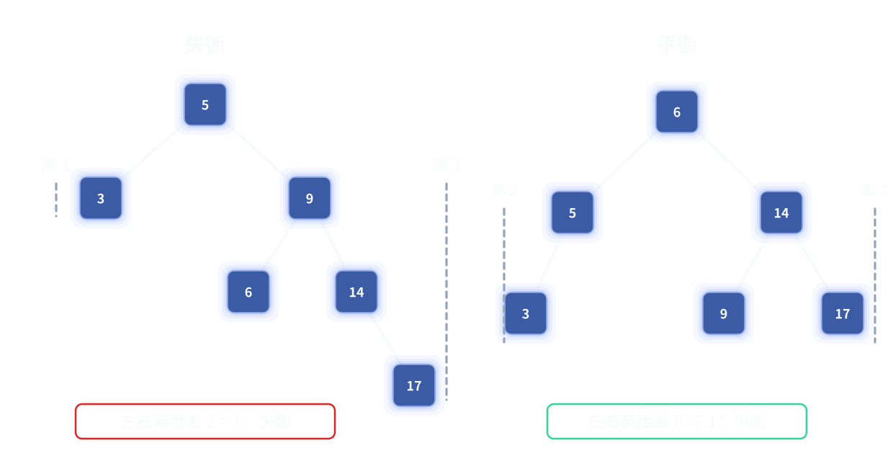
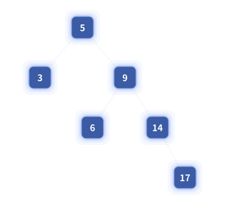
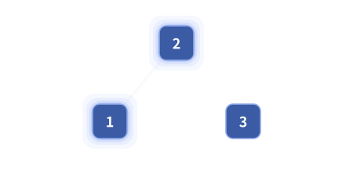
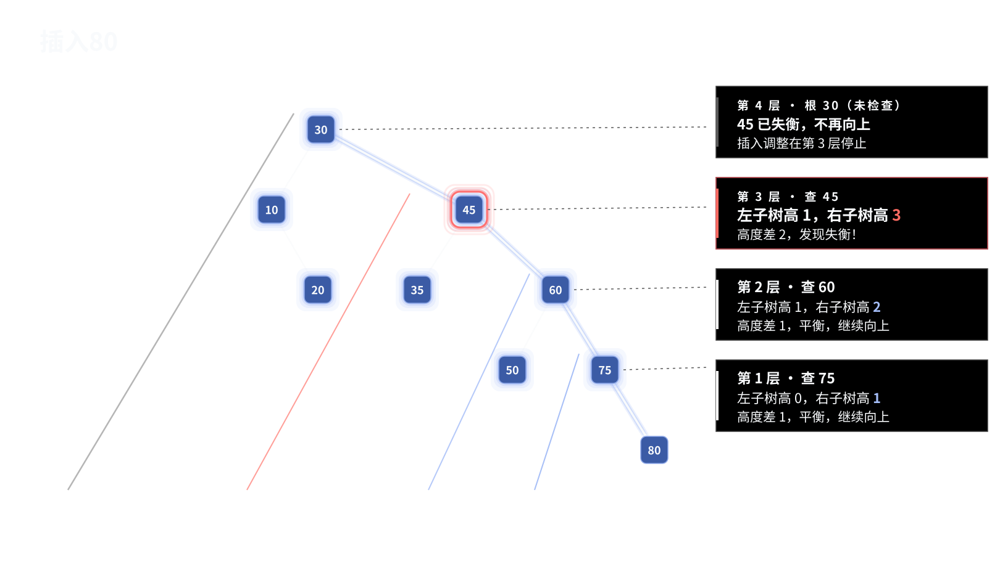
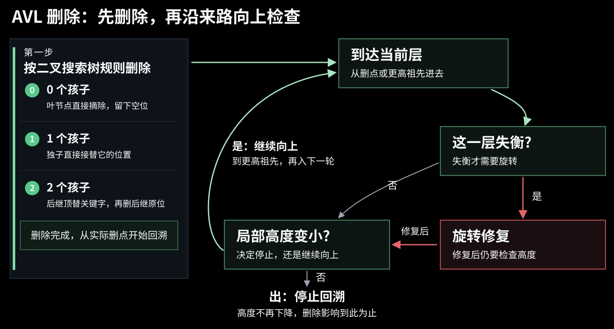
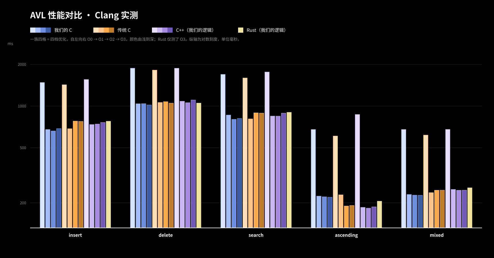

AVL 树是自平衡二叉搜索树。

AVL 这个名字来自它的两位发明者：Adelson-Velsky（阿德尔森-维尔斯基）和 Landis（兰迪斯）。

二叉搜索树的插入可能导致极度的不平衡,导致退化问题。

AVL树当不满足平衡条件的时候，它就修一修，调一调，让它重新满足平衡,从而避免退化

这个平衡条件就是任意节点左右子树高度差最大只能为一。

就比如像这样：
左边
两个子树，一个高度为一，一个高度为三，就是失衡。
那右边，
6，它的两个子树高度都为2,是平衡的。



在失衡的时候，AVL 树通过旋转操作保持平衡。

那么它是如何旋转的呢？只需两个例子我们就能彻底了解

例子一，左右失衡。




我们眼前的这是一棵不符合 AVL 的树，对吧？
5 的左子树3，高度为一，
    右子树9，14，17，这一串高度为3。
    
有些同学可能知道一些旋转方法。
但那些通通不要管，现在我来给你个新的设定：
```
	二叉树有一根天平，天平总共有三个挂载货物的地方。
	天平的左边、天平的中间、天平的右边。
	旋转时只用旋转天平，来平衡三个货物。
```
	`旋转时只用旋转天平`
你只要找到天平，然后把三个货物都摘下来，天平旋转完之后再重新按照原样挂上去。
就像我们演示的这样这样：

<video src="assets/avl-example-left-rotation.webm" controls autoplay loop muted playsinline preload="auto" aria-label="例子一左旋：选中 5—9 天平，摘下 3、6、14→17 三个货物，空杠杆左旋后按左中右原样挂回"></video>

 这里选中的 `5—9` 就是天平。
最左边挂载的子树是 `3`，中间挂载的子树是 `6`，最右边挂载的子树是 `14→17`。
我们三个货物挂载的位置没变，左边还在左边，中间还在中间，右边还在右边。
也正因此中序遍历顺序是不变的。

关键问题来了：天平位置怎么找呢？
哪边树高，哪边更重，哪边就是天平！
这里的14-17树高更高，或者说它更重，那这一边的5-9就是天平，而不是5-3。
左边一撇5-3，右边一撇5-9。就是找更重的那一边的那一撇。
	`旋转时只用旋转天平`  `哪边树高，哪边更重，哪边就是天平`
可是,为什么这样找天平呢？为什么这种旋转就能管用呢？旋转实际是在干什么呢？
这种操作实际对应的意象是这样的：

<video src="assets/avl-single-left.webm" controls autoplay loop muted playsinline preload="auto" aria-label="AVL 左旋：中间挂载子树随天平往返倾斜并滑动"></video>
AVL 树不平衡的时候，是因为有一端更重嘛，更重的那一段需要抬起来，所以天平原本应该倾斜到更重的那一边，这样旋转之后刚好把它抬起来。
找到天平之后，其实就能明显看出是左、中、右三个货物（有时候货物可能为空）。
中间的货物由于重力会滑到天平倾斜的一边。
在这里这个由插入造成的失衡里，天平一旋转，一边增加一层，另一边减少一层，原本的高度差2刚好变成0。
但这是插入场景的结论。删除时旋转修复后，高度差也可能是1，但高度差为一，仍然回到了 AVL 允许的范围
而 AVL 树原本高度差最大就是1，被打破平衡时，又只能是高度差为2。

意象归意象，实际操作时，先判断是否平衡，不平衡的话,我们找到天平，一旋转，货物左边还在左边，中间还在中间，右边还在右边，原路返回就行。

我们再来看一个，这个天平左中右都挂了一个节点，天平本身就平衡，它本身就是一棵 AVL 树。这时候能不能转？能转。刚好转成它的对称构型。但是没有必要
哪边树高？AB 这边，所以杠杆是 y-x
一开始，中间那个 B 它是滑溜到左边，那 AB 这一坨它更重。
这里我是想把中间那个 B 滑溜到C这边。现在变成了 B C 这一坨更重,其实就是把中间的货物 B 给移到了右边,这棵树的重心从左边转移到了右边。
<video src="assets/avl-right-rotation.webm" controls autoplay loop muted playsinline preload="auto" aria-label="AVL 一般右旋：三个挂载子树摘下等待，天平旋转后按左中右接回"></video>

例子二，中间失衡。

刚才的例子一是两边失衡，我们抬起一边，放下一边来保持平衡。

那么如果是天平中间那个货物更重怎么办？天平中间的货物更重，天平往左倾斜，它滑到左边，导致左边更重。天平往右倾斜，它滑到右边，导致右边更重。

那没办法，你需要先把中间的货物给移到两边，然后再通过抬起更重的那一端，来保持平衡。

所以是分两步，第一步把货物转移。第二步正常旋转天平。
把货物转移也可以通过旋转来改变重心来实现：

直接看例子你就能明白:
我们可以看到，首先我们发现右子树高度更高，是右边更重。
判断杠杆是z-y，所以三个货物分别是 A、X 与 D。
判断不平衡原因是因为中间货物 X 更重导致的。
第一次旋转：
旋转 X 所在子树，将这棵子树的重心从左边转移到右边。
现在对于杠杆z-x，恢复到两边货物更重的情况，进行第二次旋转即可。
注意，杠杆是一个形，是个形状。原本的 ZY 现在是 ZX，而不是固定的字母。


<video src="assets/avl-right-left.webm" controls autoplay loop muted playsinline preload="auto" aria-label="AVL 中间失衡分步演示：先看形状发现右边更重，据此找到杠杆 z—y 与货物 A、X、D；再判断出中间货物 X 更重才是中间失衡；第一次旋转 X 所在子树转移重心，杠杆形状变为 z—X 后进行第二次旋转"></video>

---

第一次旋转后是改变了重心,重心变了,左撇子变右撇子了,树高可没变,记住这点，后面要考

### 插入

插入前 假设最大的两颗左右子树是 n 与 n+1 ,那么树高是 n +2
插入时临时变成n 与 n + 2 ,第一次旋转后,或者说第一种旋转后,还是n 与 n + 2,
 第二次旋转后,或者说第二种旋转后, 一边增加1 一边减少 1,插入完成后最终,n变成 n+1 ,n+2变成 n + 1
 树高还是 n + 2
 中间失衡的调整不会引起树高变化。
 两边失衡只牵涉第二种旋转,同理也不会引起树高变化。
 
 那么
 无论是两边失衡,还是中间失衡
 插入前树高是多少 插入后树高是就是多少
 
 那么
 能使avl树树高增长的插入一定是无调整的,
 也就是 凡牵涉调整的插入都不会引起树高变化
 
  能使avl树树高增长的插入一定是无调整的,
 但是无调整的插入可不一定使树高增长,比如 单单一个2,左子树是 1 ,插入3



接下来让我们讲从零开始的完整插入。每插入一个数，首先肯定是按二叉搜索树的规则给它找到落点，

然后呢?

然后,首先就是插入后需要从落点沿着来路一直向上判断到根,因为插入这个节点属于很多层子树,我们需要判断它对各级子树的影响.如下图,插入80后,一层一层向上判断,判断到45这一层的时候才发现失衡。



但是在一直向上判断到根的过程中，我们发现失衡就修复，修复完还需要继续向上检查吗?

我们再来读一读这句话:修复完还需要继续向上检查吗?

是修复完 ! 那说明调整操作已经发生了,可是刚刚我们得到结论凡牵涉调整的插入都不会引起树高变化,那调整的这棵树树高没变化，它是在内部进行了修复,对外界来说是不可感的,那外界就不需要进行调整。因为对外界来说，它就相当于没变,所以其实需要且只需要调整一次!!!

也就是说，插入后需要从落点沿着来路一直向上判断到根；但是路上一但遇到失衡，就知道,哦，这次调整完就结束了,不需要再向上检查了。修完后不需要再判断是否还失衡。不需要再判断是否还失衡,不需要再判断是否还失衡

ok,那么完整的插入规则是:

按二叉搜索树的规则给它找到落点，插入后一直向上判断到根,一但遇到失衡,调整一次就提前结束

	`旋转时只用旋转天平`  `哪边树高，哪边更重，哪边就是天平` 
	`插入后一直向上判断到根,一但遇到失衡,调整一次就提前结束`

好吧,那么现在来看从零开始的完整插入:

<video src="assets/avl-insertion.webm" controls autoplay loop muted playsinline preload="auto" aria-label="从零开始依次插入 1、3、7、6、4、5、2、0、-2、-1 的完整 AVL 插入动画：每个关键字沿二叉搜索树路径落下，回溯逐层检查，7、4、5、2、-2、-1 触发失衡并按天平旋转修复，插入 0 一路无失衡直达根"></video>

- 插入 1：平衡。
- 插入 3：平衡
- 插入 7：向上检查：3 自己是平衡的；再往上是 1，它的右子树挂着 3 和 7，高两层，左子树是空，高度差 2，这里失衡了。哪边重哪边就是天平,所以天平是1-3。看三个货物：左边货物是空。中间是空，右边是 7。两边失衡直接旋转天平 1—3：左旋，货物原路返回，7 还挂在 3 的右边。整棵树恢复平衡。
- 插入 6：落在 7 的左边。向上检查：7 和 3 都是平衡的。
- 插入 4：落在 6 的左边。向上检查：6 平衡；再往上，7 的左边挂着 6 和 4，右边是空，高度差 2，这里失衡了,天平是7-6。看三个货物：左边是 4，中间是空，右边是空。两边失衡直接旋转天平 7—6：右旋，货物原路返回，4 还挂在 6 的左边。整棵树恢复平衡。
- 插入 5：落在 4 的右边。向上检查：4 和 6 都是平衡的；再往上，3 的右子树更重，高度差 2，这里失衡了。天平是3-6。看三个货物：左边是 1，中间是 4 和 5，右边是 7。中间货物更重，这是中间失衡。先右旋小天平 6—4，把 5 挂到 6 的左边；再左旋天平 3—4，货物原路返回。整棵树恢复平衡。
- 插入 2：落在 1 的右边。向上检查：1 平衡；再往上，3 的左边挂着 1 和 2，右边是空，高度差 2，这里失衡了。天平是3-1。左边是空，中间是 2，右边是空。中间货物更重，这是中间失衡。先左旋小天平 1—2；再右旋天平 3—2，货物原路返回。整棵树恢复平衡。
- 插入 0：0 比 4 小,比 2 小,比 1 小落在 1 的左边。向上检查：1、2 和 4 都是平衡的。
- 插入 -2：落在 0 的左边。向上检查：0 平衡；再往上，1 的左边挂着 0 和 -2，右边是空，高度差 2，这里失衡了。哪边重哪边就是天平,所以天平是1-0。左边是 -2，中间是空，右边是空。两边失衡,右旋1-0，货物原路返回。整棵树恢复平衡。
- 插入 -1：-1 比 4 小向左，比 2 小向左，比 0 小向左，比 -2 大向右，落在 -2 的右边。向上检查：-2 和 0 都是平衡的；再往上，2 的左子树更重，高度差 2，这里失衡了。哪边重哪边就是天平,所以天平是2-0。看三个货物：左边是 -2 和 -1，中间是 1，右边是 3。左边货物更重，这是两边失衡。直接右旋天平 2—0，货物原路返回。整棵树恢复平衡。
---
### 删除



首先按照二叉搜索树规则找到要删的节点，和二叉搜索树一样，判断是零个孩子、一个孩子还是两个孩子,两个孩子的时候，使用他的直接前驱或后继替换他,然后删掉它。之后看一下这棵树有没有失衡,
没有失衡就看一下删除导致子树变小没有
失衡了就旋转调整,这时候和插入就不一样了,调整完不能直接结束，还得再看一眼这棵子树的高度变小没有

没变小，删除的影响到这就结束了；变小了，对上层就是可感的，还得继续向上判断。所以是从删除的位置沿着来路向上检查，一直到检查的这棵子树的高度不再变小为止。
也就是说，不管是插入还是删除，需要一直向上判断到根。插入时路上遇到失衡了，就知道调整完可以停下来了。删除时，路上遇到树高不再减小,就知道可以停下来了。
删除后一直向上判断到根,哪一层树高不再减小才能结束

	`旋转时只用旋转天平`  `哪边树高，哪边更重，哪边就是天平` 
	`插入后一直向上判断到根,一但遇到失衡,调整一次就提前结束`
	`删除后一直向上判断到根,哪一层树高不再减小才能结束`

我们来看几个例子：
第一次删除9，向上看，最近的10这棵树不平衡，进行调整。原来10的位置变成11了。沿11继续向上看，8不平衡，进行调整。这已经到根了，调整结束。
第二次删除7，7只有一个孩子，直接用它的孩子取代它，向上看8，这棵子树的高度没有变小，调整结束。
第三次删除3。先和它的后继4进行交换，4这棵子树不平衡了，判断为中间失衡，进行两步调整。调整完之后，向上看5，这棵子树的高度没有变小，调整结束。

<video src="assets/avl-delete.webm" controls autoplay loop muted playsinline preload="auto" aria-label="AVL 连续删除 9、7、3：展示叶节点删除后沿回溯路径连续两次旋转、单孩子节点 7 由 6 接管、双孩子节点 3 与后继 4 的数值交换及删除，并完成双旋修复"></video>

再来一个

这是一个会连续出现两次失衡的例子。删除 64 后，先在 70 处调整；调整完成不能停下来，继续检查 59、36，直到检查根 80 时才发现第二次失衡

<video src="assets/avl-delete-to-root.webm" controls autoplay loop muted playsinline preload="auto" aria-label="AVL 删除 64：先在节点 70 处左旋，随后检查 59 和 36 都保持平衡，直到根 80 才发现第二次失衡并左旋修复"></video>

---
### AVL体系

AVL 整个体系能够成立还需要论证，对于任意一棵 AVL 树做出增加或者删除节点的操作之后，一定能通过旋转操作重新得到 AVL，这样由于只有一个节点的树就符合 AVL 树，所以这棵树可以从零增长到任意状态。并从任意状态重新删除到0。

这其实根本不需要证明：旋转操作能够平衡左中右三棵子树的高度，而增和删操作又只会破坏左中右三个子树的高度。

我们的旋转操作确实是有应用条件的，那就是高度差等于二。但是增和删每次只会操作一个数据，这顶多引起1的高度变化，所以，要么变完之后仍符合 AVL，不用调整，要么一定能调整。

---
### 编程

补充说明：人眼判断时只需观察哪一侧更高，但实际编写代码时，代码没有眼，需要引入平衡因子来判断树高。平衡因子就是左子树高度减去右子树高度。AVL 树要求每个节点的平衡因子只取 `-1、0、1`。

对于一棵不平衡的树的根：

- 根节点的平衡因子 > 1，左边沉。再读左孩子的平衡因子：左孩子的平衡因子 >= 0，左边失衡；左孩子的平衡因子 < 0，说明中间失衡，先对左孩子左旋，再对根节点右旋。
- 根节点的平衡因子 < -1，右边沉。再读右孩子的平衡因子：右孩子的平衡因子 <= 0，右边失衡；右孩子的平衡因子 > 0，说明中间失衡，先对右孩子右旋，再对根节点左旋。

传统教材把这两个问题排列组合成左左、右右、左右、右左四个名字，我们其实不过是先分成是两边沉还是中间沉两种情况，每种情况内部再各分左右。

接下来就是对应的 C 语言代码了，这个看不看都行，意义不大。
要看代码的话，我推荐你看传统的分4个模式的讲解视频和对应代码，而我给的代码是按照我们这个逻辑来写的，这里只是把它放出来，证明我们的逻辑是可以直接编写代码的。不看代码，我也推荐你再看一下传统的讲解方式，传统方法做题快，我们的方法只是可能稍微更容易理解一些。

下边是我们的代码与传统代码的对比（电脑运行状态瞬息万变，图一乐，电子斗蛐蛐），之后就是详细的代码：

图片说明：性能图使用本次已经完成的实测数据，C 和传统 C 均由 Clang 编译，C++ 使用我们的平衡因子与天平旋转逻辑，Rust 使用我们的逻辑；三种本地编译实现分别展示 `O0` 到 `O3`，Rust 使用 `-O3`。


递归版实现

先看数据结构。和普通二叉搜索树的节点比，AVL 的节点只多了一个整数 `height`，记录以它为根的这棵子树有多高，叶子是一层。然后是四个一句话工具。`maxInt`，取两数里大的那个。`heightOf`，问某个位置多高：有节点就报出它的 height，是空位就报零——有了这条约定，后面的代码都不用为空子树单写分支。`balanceFactor`，左高减右高，这就是天平的读数：正数左边沉，负数右边沉，绝对值超过一就是失衡。`updateHeight` 用在回溯的路上：任何节点的高度永远是一加较高的那个孩子，所以父亲的身高不用专门记着，回头拿两个孩子现算就行。这些函数都只在这一个文件里使用，所以一律加上 `static`，把名字关在文件内部，不给别的编译单元添乱。

```c
#include <stdlib.h>

typedef struct AVLNode {
    int key;
    int height;                     /* 本节点高度，叶子为 1 */
    struct AVLNode *left, *right;
} AVLNode;

/* 两数取大 */
static int maxInt(int a, int b) { return a > b ? a : b; }

/* 空节点高度记 0，叶子高度为 1 */
static int heightOf(AVLNode *n) { return n ? n->height : 0; }

/* 平衡因子 = 左子树高 - 右子树高，绝对值超过 1 即失衡 */
static int balanceFactor(AVLNode *n) { return heightOf(n->left) - heightOf(n->right); }

/* 插入/删除回溯时，由两个孩子重新算出本节点高度 */
static void updateHeight(AVLNode *n) {
    n->height = 1 + maxInt(heightOf(n->left), heightOf(n->right));
}
```

旋转只有一个原语：旋转天平。不需要左旋右旋两个名字——朝哪边转，重量自己会说话：沉的那端升起来做新根，轻的那端沉下去。代码同样不用指明方向，开头称一称两端谁重，方向自然就出来了。接下来就三步。第一步，换天平两端：沉的一端升起当新根，`node` 沉下去做它的孩子。第二步，中间货物原路改挂：它从升起那端的内侧摘下来，挂到沉下去那端靠近升起节点的内侧——注意它还挂在左中右的正中间，这正是中序顺序不变的原因。第三步，自底向上报身高：先沉下去的、再升起来的，顺序不能反，因为升起来那端的新身高要用对方报完之后的数来算。最后把新根交还给上层。调用方保证进入这个函数时两端必有一边更重，所以开头的方向判断不会落空。

```c
/* 旋转天平：沉的一端升起当新根，中间货物原路换挂到沉下去的一端 */
static AVLNode *rotate(AVLNode *node) {
    AVLNode *root, *middle;

    if (heightOf(node->right) > heightOf(node->left)) {   /* 右端沉：右端升起 */
        root   = node->right;         /* 升起来的右端 */
        middle = root->left;          /* 中间挂载的货物 */
        root->left  = node;           /* 天平旋转：右端升起成为新根 */
        node->right = middle;         /* 中间货物原路挂回正中间 */
    } else {                          /* 左端沉：左端升起，完全镜像 */
        root   = node->left;
        middle = root->right;
        root->right = node;
        node->left  = middle;
    }

    updateHeight(node);              /* 先更新低下去的，再更新升起来的 */
    updateHeight(root);
    return root;
}
```

插入是这套思想从头到尾走一遍。递归落下阶段就是二叉搜索树的老路由：小的往左，大的往右，走到空位就新建节点挂上去；碰到相等的关键字直接原样退回，这棵树不允许重复。真正的戏在回溯阶段：每一层先把身高报上来，再读一次 balanceFactor，然后整个交给同一个 `repair` 函数收尾。`repair` 里只有两问：第一问，读数的绝对值是不是冲到了二？没有，这层没事，原样返回。冲到了，第二问——当前节点和沉下去那一侧的孩子组成天平，称一称中间货物：中间货物更重，就先对孩子转一次，把重心挪回两端；随后不管走没走这一步，都再做一次普通旋转天平。注意这套判断从头到尾没有看新关键字落在了哪条路，它只看形状——所以这份 `repair` 插入和删除可以一字不差地共用，这是后面删除代码特别短的原因。

```c
static AVLNode *newNode(int key) {
    AVLNode *fresh = malloc(sizeof(AVLNode));
    if (fresh == NULL) exit(1);              /* 内存耗尽：教学代码直接退出，实际项目应向上报告 */
    fresh->key    = key;
    fresh->height = 1;
    fresh->left = fresh->right = NULL;
    return fresh;
}

/* 哪边沉，哪边就和本节点组成天平；先称货物，再决定转一次还是两次 */
static AVLNode *repair(AVLNode *node) {
    updateHeight(node);
    int bf = balanceFactor(node);

    if (bf > 1) {                            /* 左边沉：杠杆是 node—node->left */
        if (balanceFactor(node->left) < 0)   /* 中间货物更重：先转孩子转移重心 */
            node->left = rotate(node->left);
        return rotate(node);                 /* 旋转天平 */
    }

    if (bf < -1) {                           /* 右边沉：杠杆是 node—node->right */
        if (balanceFactor(node->right) > 0)  /* 中间货物更重 */
            node->right = rotate(node->right);
        return rotate(node);
    }

    return node;                             /* 平衡未被破坏，原样返回 */
}

static AVLNode *insert(AVLNode *node, int key) {
    if (node == NULL) return newNode(key);
    if (key == node->key) return node;           /* 不允许重复关键字 */

    if (key < node->key) node->left  = insert(node->left,  key);
    else                 node->right = insert(node->right, key);

    return repair(node);                     /* 回溯路上每层都称一次 */
}
```

查询最能说明这棵树骨子里还是二叉搜索树：小了往左，大了往右，相等就是找着了；一路走到空还没遇见，就没有。没有旋转，没有修复，一个 while 循环走到底，找到返回节点，没找到返回 NULL。

```c
/* 找到返回该节点，没找到返回 NULL */
static AVLNode *search(AVLNode *node, int key) {
    while (node != NULL && key != node->key)
        node = key < node->key ? node->left : node->right;
    return node;
}
```

删除分两段。第一段是二叉搜索树的老规矩，先把节点摘下来：沿查找路由往下走，走到空也没见着，返回空，一切照旧；命中了，先数孩子——零个或一个，把独子，也可能是空，直接接回父亲，这个节点就地释放；两个孩子挡住了单点替换，就请右子树里最小的关键字后继上来顶替：从右孩子出发一路向左走到头就是它，把关键字抄到自己身上，再到右子树里把这个后继删掉，于是删有两个孩子的节点就化成了删最多一个孩子的后继。第二段更简单：沿回溯路径逐层调用同一个 `repair`，一字不用改。这正是只看形状的好处——传统写法里插入靠新关键字认路，删除手里没有新关键字，只好改读孩子的平衡因子，两张判断表各写一份；我们这里压根没有第一张表，自然也不需要第二张。还有一点和插入不同：删除的修复可能让局部继续变矮，好在递归本来就要走完整条回溯路，天然保证一路检查到根。

```c
static AVLNode *deleteKey(AVLNode *node, int key) {
    if (node == NULL) return NULL;                 /* 走到空也没见着：树里没有它 */

    if (key < node->key)      node->left  = deleteKey(node->left,  key);
    else if (key > node->key) node->right = deleteKey(node->right, key);
    else {
        if (node->left == NULL || node->right == NULL) {
            AVLNode *child = node->left ? node->left : node->right;
            free(node);
            return child;                          /* 独子（或空）直接接回父亲 */
        }
        AVLNode *succ = node->right;               /* 右子树最小关键字：一路向左 */
        while (succ->left) succ = succ->left;
        node->key  = succ->key;                    /* 后继顶替自己 */
        node->right = deleteKey(node->right, succ->key);   /* 再去右子树删掉后继 */
    }

    return repair(node);                           /* 和插入共用同一份修复 */
}
```

rust版本

```rust
use std::cmp::Ordering;

type Link = Option<Box<Node>>;

struct Node {
    key: i32,
    height: i32,
    left: Link,
    right: Link,
}

#[derive(Default)]
struct AvlTree {
    root: Link,
    rotations: u64,
}

#[inline]
fn height(node: Option<&Node>) -> i32 {
    node.map_or(0, |node| node.height)
}

#[inline]
fn balance_factor(node: &Node) -> i32 {
    height(node.left.as_deref()) - height(node.right.as_deref())
}

#[inline]
fn update_height(node: &mut Node) {
    node.height = 1 + height(node.left.as_deref()).max(height(node.right.as_deref()));
}

// 只旋转当前天平，方向由两端的高度决定。
#[inline]
fn rotate(mut node: Box<Node>, rotations: &mut u64) -> Box<Node> {
    if height(node.right.as_deref()) > height(node.left.as_deref()) {
        let mut root = node.right.take().expect("right side must be non-empty");
        let middle = root.left.take();
        node.right = middle;
        update_height(&mut node);
        root.left = Some(node);
        update_height(&mut root);
        *rotations += 1;
        root
    } else {
        let mut root = node.left.take().expect("left side must be non-empty");
        let middle = root.right.take();
        node.left = middle;
        update_height(&mut node);
        root.right = Some(node);
        update_height(&mut root);
        *rotations += 1;
        root
    }
}

// 先读根节点的平衡因子，再读沉下去一侧孩子的平衡因子。
#[inline]
fn repair(mut node: Box<Node>, rotations: &mut u64) -> Box<Node> {
    update_height(&mut node);
    let factor = balance_factor(&node);

    if factor > 1 {
        if balance_factor(node.left.as_deref().expect("left side must be non-empty")) < 0 {
            let left = node.left.take().expect("left side must be non-empty");
            node.left = Some(rotate(left, rotations));
        }
        return rotate(node, rotations);
    }

    if factor < -1 {
        if balance_factor(node.right.as_deref().expect("right side must be non-empty")) > 0 {
            let right = node.right.take().expect("right side must be non-empty");
            node.right = Some(rotate(right, rotations));
        }
        return rotate(node, rotations);
    }

    node
}

#[inline]
fn insert(tree: Link, key: i32, rotations: &mut u64) -> Link {
    let mut node = match tree {
        Some(node) => node,
        None => {
            return Some(Box::new(Node {
                key,
                height: 1,
                left: None,
                right: None,
            }));
        }
    };

    match key.cmp(&node.key) {
        Ordering::Less => {
            node.left = insert(node.left.take(), key, rotations);
        }
        Ordering::Greater => {
            node.right = insert(node.right.take(), key, rotations);
        }
        Ordering::Equal => return Some(node),
    }

    Some(repair(node, rotations))
}

#[inline]
fn remove_min(mut node: Box<Node>, rotations: &mut u64) -> (i32, Link) {
    match node.left.take() {
        None => (node.key, node.right.take()),
        Some(left) => {
            let (key, new_left) = remove_min(left, rotations);
            node.left = new_left;
            (key, Some(repair(node, rotations)))
        }
    }
}

#[inline]
fn delete(tree: Link, key: i32, rotations: &mut u64) -> Link {
    let mut node = match tree {
        Some(node) => node,
        None => return None,
    };

    match key.cmp(&node.key) {
        Ordering::Less => {
            node.left = delete(node.left.take(), key, rotations);
        }
        Ordering::Greater => {
            node.right = delete(node.right.take(), key, rotations);
        }
        Ordering::Equal => match (node.left.take(), node.right.take()) {
            (None, right) => return right,
            (left, None) => return left,
            (Some(left), Some(right)) => {
                let (successor, new_right) = remove_min(right, rotations);
                node.key = successor;
                node.right = new_right;
                node.left = Some(left);
            }
        },
    }

    Some(repair(node, rotations))
}

impl AvlTree {
    #[inline]
    fn insert(&mut self, key: i32) {
        self.root = insert(self.root.take(), key, &mut self.rotations);
    }

    #[inline]
    fn delete(&mut self, key: i32) {
        self.root = delete(self.root.take(), key, &mut self.rotations);
    }

    #[inline]
    fn contains(&self, key: i32) -> bool {
        let mut current = self.root.as_deref();
        while let Some(node) = current {
            current = match key.cmp(&node.key) {
                Ordering::Less => node.left.as_deref(),
                Ordering::Greater => node.right.as_deref(),
                Ordering::Equal => return true,
            };
        }
        false
    }
}
```
