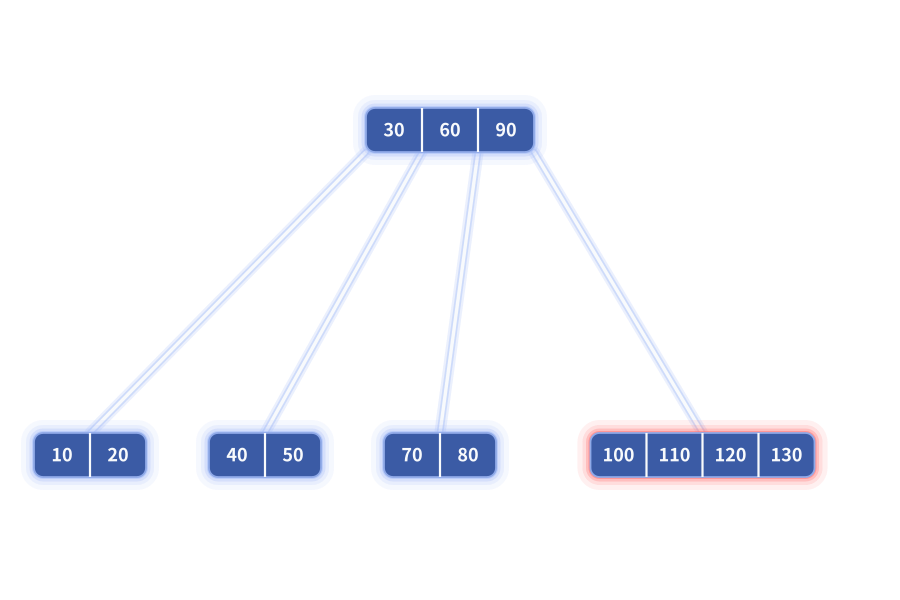
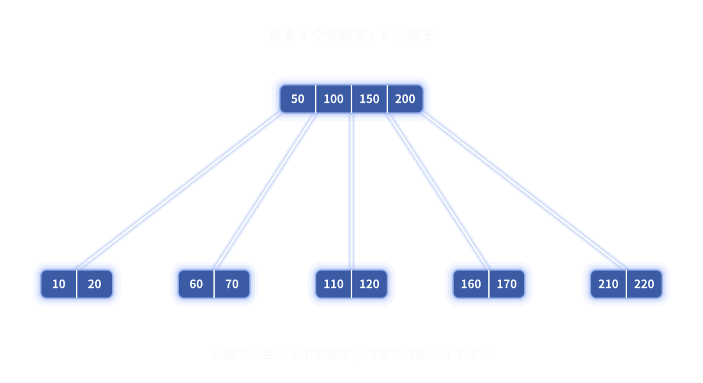
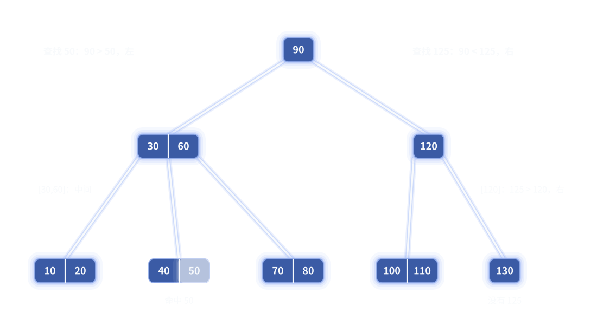
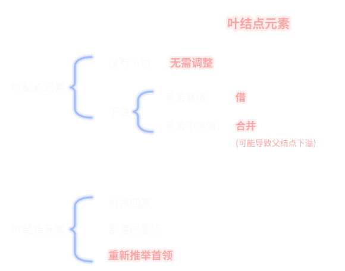
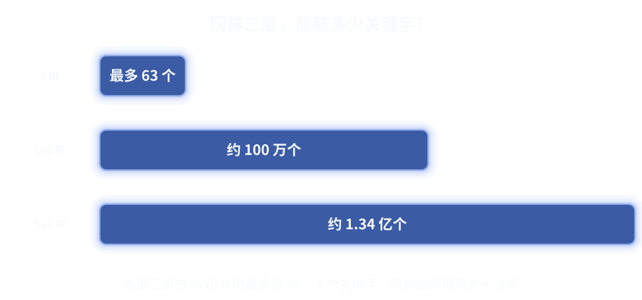

<video src="assets/bst-increasing.webm" controls autoplay loop muted playsinline preload="auto" aria-label="递增插入导致二叉搜索树退化"></video>
二叉搜索树在插入有序的时候会产生歪脖子树，导致退化。

为什么会这样呢？因为二叉搜索树,谁先插入谁就是根。接下来插入的就当第一层,然后是第二层,以此类推。
层数越靠上，它越起到一个索引的作用，而索引质量正是时间复杂度的关键。但是二叉搜索树的索引竟然是谁先来谁就是索引,所以一旦脖子歪了，那是一步错，步步错。

B 树解决的就是这一点。B 树自下向上生长,越靠上的索引越晚诞生，是由各级动态推举产生。

---

## 先来看看B 树的定义

`m` 阶 B 树是需要满足以下条件：

- 所有叶子都处在同一深度
- 每个节点最多有`m − 1` 个关键字 `m` 个孩子
- 每个节点至少有 `⌈m/2⌉ − 1` 个关键字 `⌈m/2⌉` 个孩子( `⌈  ⌉` 是上取整,`⌊  ⌋ `是下取整)
- 特例:非空 B 树的根节点至少有一个关键字；如果根节点不是叶子，至少有两个孩子，根节点可以不满足普通节点的最低容量限制。
  叶节点没有孩子。

B树的“阶数”描述的是一个节点的最大分支数.

接下来出场的五阶B树和四阶B树，将会带你了解这一切。

## 4 阶 B 树

### 4阶 B 树的节点

按照定义
4阶B树:一个节点最多有四个孩子，最多有4-1=3个关键字。至少有4/2=2两个孩子、2-1=1个关键字；下图中最右边标红的四个节点就是不符合定义的接下来它需要进行上溢分裂。

### 再来看一下5阶B树:

5 阶 B 树最多有 4 个关键字。至少有 2 个关键字；下面这棵树的根节点正好有 4 个关键字和 5 个孩子，处在最大容量；下面的每个叶子都有 2 个关键字，处在最低容量,所有叶子仍然在同一深度。




### 4阶B树的查找:
查找还是和二叉搜索树都差不多。

查找 `50` 时，从根节点 `90` 走左边，`[30,60]` 选择中间孩子，最后在 `[40,50]` 中命中；查找 `125` 时，从根节点 `90` 走右边，`[120]` 继续走右边，到达 `[130]` 后确认树中没有 `125`。



### 2. 插入

插入也很简单,我们直接来看例子。

10,20,30,40 发生上溢,这里我统一推举出上中位;

40,50,60,70 发生上溢,推举出60;

40,45,50,55 推举出50;

70,80,90,100 推举出90;

再看上层,30,50,60,90 推举出 60.
<video src="assets/btree-insert.webm" controls autoplay loop muted playsinline preload="auto" aria-label="在同一棵四阶 B 树上按 10、20、30、40、50、60、70、45、55、80、90、100 连续插入：四次叶节点或父节点溢出分别推举 30、60、50、90，最后父节点 [30,50,60,90] 溢出并推举 60 成为新根，分裂后的节点保持叶子同深"></video>

总之,B 树的插入先沿搜索路径到达叶子。关键字加入后，如果节点没有上溢出，插入结束；如果节点溢出，就分裂节点，把中间关键字推举到父节点。

父节点也可能因此溢出，继续向上分裂推举。一直到某一级不再溢出；如果根溢出，就产生新根，整棵树增加一层。

### 3. 删除
二叉搜索树 、红黑树、 AVL 树,他们对于有两个孩子的节点的删除，都是转化为删除直接前驱或后继。
我们 B 树也不例外,删除有两种方法,两种方法也都需要转化为删除叶节点。

接下来这些例子都是基于四阶 B 树。一共分三种情况。

第一种是首领回家删完还上溢出,还要再推举上去。推举上的还是同一个首领。相当于是原本删除就不下溢
这里我们删除10
对于我们的方法。把40拉下来。把十删掉。40又被重新推举上去。

对于传统方法，这个节点删除时并不会下溢出，直接删除就行。

<video src="assets/btree-case1-compare.webm" controls autoplay loop muted playsinline preload="auto" aria-label="左右窗口分时展示删除 10：先播放我们的首领回家法，切换阴影并停顿 2.5 秒后，再播放传统的直接删除法"></video>

第二种,首领回家删完还上溢出,还要再推举上去.推举上的不是老首领。相当于是兄弟够借

还是删除10,我们的方法操作不变。

传统方法属于下溢出，需要问兄弟借，兄弟够借。发生了旋转。

<video src="assets/btree-case2-compare.webm" controls autoplay loop muted playsinline preload="auto" aria-label="左右窗口分时展示删除 10：先播放我们的首领回家法，切换阴影并停顿 2.5 秒后，再播放传统的兄弟够借法"></video>


第三种，首领回家，删完不上溢出,相当于合并,这种情况删完之后。父节点那一层就少了一个元素，所以父节点可能会下溢出。

先删除10,导至下溢出,首领20回家,没有可推举的。原本20的位置发生下溢出,首领50回家,没有可推举的。
再删除90,首领100回家,原本100的位置发生下溢出,首领80回家。

传统方法也是一样的。

<video src="assets/btree-case3-compare.webm" controls autoplay loop muted playsinline preload="auto" aria-label="三层四阶 B 树先后删除 10 和 90 的左右窗口分时对比：先播放首领回家法，切换阴影并停顿 2.5 秒后，再播放传统的兄弟判断与级联合并法"></video>

有一点忘说了,问兄弟借的时候是问左右兄弟借左右都行。首领回家也是左右首领回家都行，

连在一起看一看:

<video src="assets/btree-delete-5-slow.webm" controls autoplay loop muted playsinline preload="auto" aria-label="一个四层五阶 B 树展示全部删除动作，按原视频 0.6 倍速播放：先删除内部关键字 450，与后继 460 交换；再删除叶节点 450，分隔关键字 500 被两个子民拉着回家，合并后不超过容量，直接合并；再删除叶节点 410，合并后超过容量，中间关键字 500 推举回父层；随后删除叶节点 360，分隔关键字 380 拉回并合并，节点下溢亮红边；分隔关键字 300 和根关键字 400 继续被子民拉着回家，两个上层节点依次下溢，最终根变空，合并节点上升成为新根，树从四层缩成三层"></video>

---

## 从 4 阶推广到任意阶


### 阶数决定容量，不改变机制

换了阶数之后，查找仍然沿路由自顶向下；满了照样取中间关键字推举上移；下溢出了照样先向兄弟借、借不到就和父分隔关键字合并。变的只是"上溢"与"下溢"的阈值，以及每一层能装下多少数据。

 每个节点最多有`m − 1` 个关键字 `m` 个孩子
 每个节点至少有 `⌈m/2⌉ − 1` 个关键字 `⌈m/2⌉` 个孩子
 
 最多 m-1 关键字。再插入一个变成 m 但是上溢出还要推举出一个
 分裂时是对 m -1 关键字平分为两半。考虑到奇偶问题。最终可以是 `⌈m/2⌉ − 1`

高度三层的 m 阶 B 树最多能存 `m³ − 1` 个关键字，不同阶数差出的是数量级：

图片说明：静态图对比同样三层时 4 阶、100 阶、512 阶各自能存的关键字数量级，说明阶数由存储页的大小决定。



普通外存设备读写速度很慢，但是他们有个特点在一定程度上它们读取一大段数据的时间,与读取一两个字节的时间几乎是一样的,读取一样多的数据,读取次数越少越好。

这正是 B 树被发明出来的场景
磁盘一次寻址读写一整页，把一整页做成一个大节点，树的层数就约等于寻址次数。几百阶的 B 树只要三四层就能覆盖上亿条数据.

还有一点就是 B 树的并发写入改造比较简单

那么古尔丹代价是什么呢？

B 树的代价，首先是空间利用率,B 树每个节点内部都是一个数组。为了让节点在删除之后仍然保持平衡，普通节点通常至少要半满；但分裂、删除和合并之后，节点并不一定能恰好装满，所以一页里可能会留下一部分空槽。关键字和孩子指针的大小不固定时，还会产生对齐和页内碎片。阶数越大，单个节点预留的页空间越大，这种没有被有效数据填满的空间也可能越多。

其次，节点变大以后，节点内部的工作也变多了。查找要在一组关键字中定位路由，插入和删除还可能要移动一段关键字和指针；节点满了要分裂，节点过空要向兄弟借或者合并，并且这些变化可能一路影响父节点，带来更多页写入。

这B树确实不错。
可对于内存几乎没有页代价,有没有性能更强空间还不浪费的数据结构呢？
有的

## 完

### 编程

下面的代码固定演示四阶 B 树(递归版)：每个节点最多三个关键字，非根节点至少一个关键字。插入时，关键字沿搜索路径落到叶子；发生上溢，就把上中位关键字作为首领推举到父节点，父节点也可能继续上溢并向上推举。删除时采用前文的统一语义：沿目标路径先把父节点的首领带回家，与相邻节点合并；然后在合并后的节点中删除关键字。如果删完仍然上溢，就把中间首领重新推举回父节点；如果没有上溢，父节点少了一个关键字，继续检查父节点是否下溢。删除内部节点的关键字时，先用右子树最小关键字后继顶替，再去删除后继所在的叶节点。

```c
#include <assert.h>
#include <stdbool.h>
#include <stdio.h>
#include <stdlib.h>

enum {
    ORDER = 4,
    MAX_KEYS = ORDER - 1,
    MIN_KEYS = (ORDER + 1) / 2 - 1,

    /* 首领回家后，两个节点和一个父分隔关键字暂时放在一起。 */
    TEMP_MAX_KEYS = 2 * MAX_KEYS + 1,
    TEMP_MAX_CHILDREN = TEMP_MAX_KEYS + 1
};

typedef struct BTreeNode {
    int key_count;
    int keys[TEMP_MAX_KEYS];
    bool leaf;
    struct BTreeNode *children[TEMP_MAX_CHILDREN];
} BTreeNode;

typedef struct {
    BTreeNode *root;
} BTree;

typedef struct {
    bool happened;
    int leader;
    BTreeNode *right;
} Split;

static void *checked_malloc(size_t size) {
    void *memory = malloc(size);
    if (memory == NULL) {
        fprintf(stderr, "out of memory\n");
        exit(EXIT_FAILURE);
    }
    return memory;
}

static BTreeNode *new_node(bool leaf) {
    BTreeNode *node = checked_malloc(sizeof(*node));
    node->key_count = 0;
    node->leaf = leaf;
    for (int i = 0; i < TEMP_MAX_CHILDREN; ++i)
        node->children[i] = NULL;
    return node;
}
```

#### 节点查找与插入

```c

static int lower_bound(const BTreeNode *node, int key) {
    int position = 0;
    while (position < node->key_count && node->keys[position] < key)
        ++position;
    return position;
}

static bool contains(const BTreeNode *node, int key) {
    while (node != NULL) {
        int position = lower_bound(node, key);
        if (position < node->key_count && node->keys[position] == key)
            return true;
        if (node->leaf)
            return false;
        node = node->children[position];
    }
    return false;
}

/*
 * 节点上溢时取上中位：四个关键字 [10,20,30,40] 推举 30，
 * 左边留下 [10,20]，右边留下 [40]。
 */
static Split split_node(BTreeNode *node) {
    Split result = { true, 0, NULL };
    int total = node->key_count;
    int middle = total / 2;
    BTreeNode *right = new_node(node->leaf);

    result.leader = node->keys[middle];
    result.right = right;
    right->key_count = total - middle - 1;
    for (int i = 0; i < right->key_count; ++i)
        right->keys[i] = node->keys[middle + 1 + i];

    if (!node->leaf) {
        for (int i = 0; i <= right->key_count; ++i) {
            right->children[i] = node->children[middle + 1 + i];
            node->children[middle + 1 + i] = NULL;
        }
    }
    node->key_count = middle;
    return result;
}

static void put_split_into_parent(BTreeNode *parent, int child_index,
                                  Split split) {
    for (int i = parent->key_count; i > child_index; --i)
        parent->keys[i] = parent->keys[i - 1];
    for (int i = parent->key_count + 1; i > child_index + 1; --i)
        parent->children[i] = parent->children[i - 1];

    parent->keys[child_index] = split.leader;
    parent->children[child_index + 1] = split.right;
    ++parent->key_count;
}

/*
 * 插入的上溢沿递归回溯：子节点先分裂并推举首领，
 * 父节点接过首领后如果也溢出，再把自己的首领继续向上交给父亲。
 */
static Split insert_recursive(BTreeNode *node, int key) {
    if (node->leaf) {
        int position = lower_bound(node, key);
        for (int i = node->key_count; i > position; --i)
            node->keys[i] = node->keys[i - 1];
        node->keys[position] = key;
        ++node->key_count;
    } else {
        int child_index = lower_bound(node, key);
        Split split = insert_recursive(node->children[child_index], key);
        if (split.happened)
            put_split_into_parent(node, child_index, split);
    }

    if (node->key_count > MAX_KEYS)
        return split_node(node);
    return (Split){ false, 0, NULL };
}

static void insert(BTree *tree, int key) {
    if (contains(tree->root, key))
        return;                         /* 这份示例不保存重复关键字 */

    if (tree->root == NULL) {
        tree->root = new_node(true);
        tree->root->keys[0] = key;
        tree->root->key_count = 1;
        return;
    }

    Split split = insert_recursive(tree->root, key);
    if (split.happened) {
        BTreeNode *new_root = new_node(false);
        new_root->keys[0] = split.leader;
        new_root->key_count = 1;
        new_root->children[0] = tree->root;
        new_root->children[1] = split.right;
        tree->root = new_root;
    }
}
```

#### 删除辅助函数

```c

static int minimum_key(const BTreeNode *node) {
    while (!node->leaf)
        node = node->children[0];
    return node->keys[0];
}

/*
 * 首领回家：把 parent 的一个分隔关键字拉到两个孩子之间，
 * 合并成一个暂时节点，并从 parent 删除这个分隔关键字。
 * 暂时节点允许超过三个关键字，删除完成后再由 finish_child 推举。
 *
 * 优先和右兄弟合并；如果目标已经是最右孩子，就和左兄弟合并。
 * 返回合并后目标子树所在的下标。
 */
static int bring_leader_home(BTreeNode *parent, int child_index) {
    int separator_index;
    int left_index;
    int right_index;

    if (child_index < parent->key_count) {
        separator_index = child_index;
        left_index = child_index;
        right_index = child_index + 1;
    } else {
        separator_index = child_index - 1;
        left_index = child_index - 1;
        right_index = child_index;
    }

    BTreeNode *left = parent->children[left_index];
    BTreeNode *right = parent->children[right_index];
    int old_left_keys = left->key_count;
    int old_right_keys = right->key_count;

    left->keys[old_left_keys] = parent->keys[separator_index];
    for (int i = 0; i < old_right_keys; ++i)
        left->keys[old_left_keys + 1 + i] = right->keys[i];

    if (!left->leaf) {
        for (int i = 0; i <= old_right_keys; ++i)
            left->children[old_left_keys + 1 + i] = right->children[i];
    }
    left->key_count = old_left_keys + 1 + old_right_keys;

    for (int i = separator_index; i < parent->key_count - 1; ++i)
        parent->keys[i] = parent->keys[i + 1];
    for (int i = right_index; i < parent->key_count; ++i)
        parent->children[i] = parent->children[i + 1];
    parent->children[parent->key_count] = NULL;
    --parent->key_count;

    free(right);
    return left_index;
}

/* 合并后的节点若上溢，就把新的中间首领推举回 parent。 */
static void finish_child(BTreeNode *parent, int child_index) {
    BTreeNode *child = parent->children[child_index];
    if (child->key_count > MAX_KEYS) {
        Split split = split_node(child);
        put_split_into_parent(parent, child_index, split);
    }
}

static void remove_leaf_key(BTreeNode *leaf, int position) {
    for (int i = position; i < leaf->key_count - 1; ++i)
        leaf->keys[i] = leaf->keys[i + 1];
    --leaf->key_count;
}

/*
 * 删除最小关键字，供“内部关键字先由后继顶替”使用。
 * 后继真正从叶子删掉以后，才允许外层把分隔首领带回家，
 * 因而不会把同一个后继同时留在父子两层。
 */
static bool delete_minimum(BTreeNode *node, bool is_root) {
    if (node->leaf) {
        remove_leaf_key(node, 0);
        return !is_root && node->key_count < MIN_KEYS;
    }

    int child_index = bring_leader_home(node, 0);
    bool underflow = delete_minimum(node->children[child_index], false);
    if (underflow)
        child_index = bring_leader_home(node, child_index);
    finish_child(node, child_index);
    return !is_root && node->key_count < MIN_KEYS;
}
```

#### 删除主流程

```c

/*
 * 删除普通关键字：进入下一层之前先首领回家；
 * 删除完成后，合并节点若上溢就首领推举，父节点若下溢则向上返回。
 */
static bool delete_recursive(BTreeNode *node, int key, bool is_root) {
    if (node->leaf) {
        int position = lower_bound(node, key);
        if (position < node->key_count && node->keys[position] == key)
            remove_leaf_key(node, position);
        return !is_root && node->key_count < MIN_KEYS;
    }

    int position = lower_bound(node, key);
    int child_index;
    int key_to_delete = key;

    if (position < node->key_count && node->keys[position] == key) {
        /* 内部节点删除转化为删除右子树中的后继。 */
        key_to_delete = minimum_key(node->children[position + 1]);
        node->keys[position] = key_to_delete;
        child_index = position + 1;

        bool underflow = delete_minimum(node->children[child_index], false);
        if (underflow)
            child_index = bring_leader_home(node, child_index);
    } else {
        child_index = bring_leader_home(node, position);
        bool underflow = delete_recursive(
            node->children[child_index], key_to_delete, false);
        if (underflow)
            child_index = bring_leader_home(node, child_index);
    }

    finish_child(node, child_index);
    return !is_root && node->key_count < MIN_KEYS;
}

static bool erase(BTree *tree, int key) {
    if (!contains(tree->root, key))
        return false;

    delete_recursive(tree->root, key, true);

    if (tree->root->key_count == 0) {
        BTreeNode *old_root = tree->root;
        if (old_root->leaf)
            tree->root = NULL;
        else
            tree->root = old_root->children[0];
        free(old_root);
    }
    return true;
}
```

#### 输出与示例

```c

static void print_tree(const BTreeNode *node, int depth) {
    if (node == NULL)
        return;
    for (int i = 0; i < depth; ++i)
        printf("  ");
    printf("[");
    for (int i = 0; i < node->key_count; ++i)
        printf("%s%d", i == 0 ? "" : ",", node->keys[i]);
    printf("]\n");
    if (!node->leaf)
        for (int i = 0; i <= node->key_count; ++i)
            print_tree(node->children[i], depth + 1);
}

static void destroy(BTreeNode *node) {
    if (node == NULL)
        return;
    if (!node->leaf)
        for (int i = 0; i <= node->key_count; ++i)
            destroy(node->children[i]);
    free(node);
}

int main(void) {
    BTree tree = { NULL };
    const int inserted[] = {
        10, 20, 30, 40, 50, 60, 70, 45, 55, 80, 90, 100
    };
    const int removed[] = { 10, 45, 60, 90 };

    for (size_t i = 0; i < sizeof(inserted) / sizeof(inserted[0]); ++i)
        insert(&tree, inserted[i]);
    for (size_t i = 0; i < sizeof(inserted) / sizeof(inserted[0]); ++i)
        assert(contains(tree.root, inserted[i]));

    printf("after insertion:\n");
    print_tree(tree.root, 0);

    for (size_t i = 0; i < sizeof(removed) / sizeof(removed[0]); ++i) {
        assert(erase(&tree, removed[i]));
        assert(!contains(tree.root, removed[i]));
    }

    printf("after leader-home deletion:\n");
    print_tree(tree.root, 0);
    destroy(tree.root);
    return 0;
}
```
