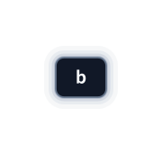
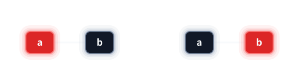
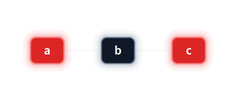
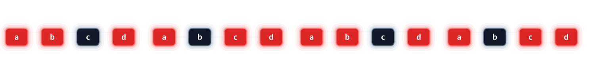

# 红黑树是4阶B树的二叉编码

### 性能比较

上一节我们讲到了 B 树，它是自下向上生长,解决了索引质量的问题,B树中4阶B树很特殊,他能够进行二叉编码,而其中最鼎鼎大名的二叉编码方案就是红黑颜色体系

二叉化,把原本的数组也变成了一个一个的节点,通过节点与指针解决了4阶B树空间利用率的问题。并且所有操作都是对二叉树节点的操作，没有内部是数组这个概念了,语义更统一,性能也更高了。

我在我的电脑上粗略的测试了一下，结果是这样的。(内存,固定cpu频率,非递归)

| 结构 | 操作 | 时间 | 峰值节点数 | 载荷大小 | 单节点大小 |
| --- | --- | ---: | ---: | ---: | ---: |
| 传统四阶 B 树 | 插入 `10,000,000` 个键 | `11602.998 ms` | `5,592,056` | `32 B` | `152 B` |
| 红黑树 | 插入 `10,000,000` 个键 | `7346.296 ms` | `10,000,000` | `32 B` | `64 B` |
| 传统四阶 B 树 | 查找 `20,000,000` 次 | `6150.532 ms` | `5,592,056` | `32 B` | `152 B` |
| 红黑树 | 查找 `20,000,000` 次 | `6836.989 ms` | `10,000,000` | `32 B` | `64 B` |
| 传统四阶 B 树 | 删除 `10,000,000` 个键 | `11232.327 ms` | `5,592,056` | `32 B` | `152 B` |
| 红黑树 | 删除 `10,000,000` 个键 | `11017.106 ms` | `10,000,000` | `32 B` | `64 B` |
这里我们使用的是32B大小的载荷。越大的载荷,B树空间浪费越明显

接下来我们就来看看它是如何进行二叉化的。但在这之前，最好先观看我对 AVL 树以及 B 树的讲解,否则推举、旋转之类的操作可能听不懂。

## 从 2-3-4 节点到红黑节点
每一个 B 树节点内部只有一个是黑节点

`[b]` 直接编码成黑色节点 `b`。

 `[a,b]` 可以选 `a` 或 `b` 作为黑色主体，另一个关键字作为红色孩子。普通红黑树允许两种方向选 a 选 b 都可以；

`[a,b,c]` 可以编码为黑色主体 `b`，左侧红色孩子 `a`，右侧红色孩子 `c`。

一个 4个关键字的节点如何表示呢?也就是刚好符合上溢出的情况。
是这样的:

一棵完整的 B 树变成红黑树就像下边这样。

<video src="assets/rb-encoding.webm" controls autoplay loop muted playsinline preload="auto" aria-label="一棵复杂 B 树变为二叉编码：先原地染色，再让所有节点内部的成员同步拉开，最后先把叶层、再把内层调整为二叉树形；全过程不重染、不分裂、不修复，终态保留红红相连，作为后续修复的起点"></video>

红黑树有四个性质:左根右,根叶黑,不红红,黑路同

左跟右是二叉树搜索树就有的特性。
4阶B树二叉编码后它是二叉搜索树符合二叉搜索树的特性->左根右

黑路同是我们通过4阶B树观察到的特性,这个特性同时保证了对 B 树的下溢出调整
B 树的所有叶结点高度相同，故而黑色节点的高度都相同->黑路同。
4阶B树最少一个关键字,删除黑色节点下溢出,不满足黑路同。

不红红是为了 B 树的上溢出调整。
容量为3的 B 树节点,插入红节点,违反不红红，上溢出
黑接点的左右被染成红色,红色节点中间始终隔着一个黑节点->不红红

根叶黑是语义完备性。
根页黑是为了红黑染色语义的完备性,能大幅简化对红黑树插入删除规则的描述。
这让每个节点都有叔叔。

## 插入：分裂在二叉接口中的表现
B 树的每个节点组都有已经黑节点,所以我们插入时肯定插入的是红节点。

<video src="assets/rb-insert-v4.webm" controls autoplay loop muted playsinline preload="auto" aria-label="在复杂树上依次插入 52、54、22、37、50：前四次插入完成后，50 插到 51 左侧触发上溢，52 推举到父层，随后 52 变红、51 和 54 变黑"></video>
插入52,在黑节点51的左边，没有问题。插入54。违反不红红,进行了相应的调整，它其实对应的就是旋转操作。

插入54后，51这个节点属于红节点两边失衡(LL,RR),进行了相应的旋转操作。旋转完之后重新变色,使他符合我们红黑树的要求。

<video src="assets/rb-ll-rr.webm" controls autoplay loop muted playsinline preload="auto" aria-label="红黑树两边失衡：55 为根，左侧 51、52、54 形成红红相连，左旋后再变色修复"></video>
插入22,违法了不红红,进行了相应的调整,实际对应的是中间失衡(LR,RL)的旋转操作。对于杠杆21-23
左孩子是空，中间是22，右孩子也是空，中间更重,进行相应的旋转。旋转完之后进行变色。
红节点中间失衡(LR,RL):
<video src="assets/rb-lr-rl.webm" controls autoplay loop muted playsinline preload="auto" aria-label="红黑树中间失衡：20 右侧 21、23、22 形成折线，先旋转中间局部，再旋转根侧杠杆，最后变色"></video>
插入37,违反不红红,对于四阶B树来说，是上溢出。
对于上溢出:
红黑树在推举的时候由于二叉编码化所带来的额外的连接关系,我们只能够推举含有两个孩子的节点,也就是黑节点,我们不能指定上中位,或者下中位。
但是红黑树不管如何推举，它肯定仍然是所有推举解集中的一种。之后在删除中，我们也会看到红黑树哪个首领回家，以及重新推举谁身不由己,根据它的连接关系，它只能这样或那样，但是它肯定是解集中的一种。
<video src="assets/rb-overflow.webm" controls autoplay loop muted playsinline preload="auto" aria-label="四键上溢的最后一种局部结构：先尝试推举 C，改选 B 推举，随后 B 变红、A 和 D 变黑、B 最后变黑"></video>

注意，我们推举上去之后，一定要把这个黑节点变成红色。就像我们红黑树插入的时候，一定插入的是红结点一样。如果第一次插入,插入的位置是根的话。再把红的变成黑的。如果推举上去的是新根的话,再把推举上去的变成黑的。而推举上去是红色的,他的两个孩子顺势变成黑色的,也就是传说中的叔父爷变色。

最后我们插入50,推举黑节点,不违反不红红，不需要调整

但是对红黑树它已经二叉编码化了,不像 B 树那些节点原生就是在同一层的。红黑树再判断哪些节点是同一层就有点得不偿失了,刚刚我们所讲的那些道理是这么个道理,但是实际编程时不能这样写
编程时插入的规则就是:如果违反不红红(有叔叔结点),违反不红红内部还可以再分两种情况。
叔叔是红色--->叔父爷变色,以爷节点的位置继续向上判断
叔叔是黑色--->旋转(LL,RR,LR,RL),然后变色,

## 删除：下溢的二叉表示
删除还是第一步先像二叉搜索树一样。

有两个孩子转化删除直接前驱或后继变成只有0个孩子的删除。也就是说转化为对最后一层的操作。

有一个孩子的，直接用那一个孩子顶替。但是根据四阶 B 树的定义，除了最后一层那些节点,都是最少有一个关键字有两个孩子。

那最后一层那些节点，谁能有一个孩子呢？就是一红一黑，这个红相当于黑的孩子。我们把黑删掉之后，红色重新变成黑色就行了,就只有这两种情况。
<video src="assets/rb-delete-one-child.webm" controls autoplay loop muted playsinline preload="auto" aria-label="红黑树只有一个孩子时的两种镜像情况：删除黑节点后，唯一的红孩子顶替原位置并重新染成黑色"></video>

OK，两个孩子的转化成零个孩子的，一个孩子的刚刚也讲过了。
对于0个孩子的删除情况。

如果删除的是红色节点，黑高不变,删除后无需任何调整。

<video src="assets/rb-delete-zero-child.webm" controls autoplay loop muted playsinline preload="auto" aria-label="红黑树删除红色叶节点：删除后黑高不变，无需任何调整"></video>
![[rb-delete-decision-tree.svg|713]]

如果删除的是黑色节点,那么按照 B 树来说，可以首领回家重新推举,B树中，首领回家重新推举得到的是一个解集。B 树始终采用的是解集中的最优解,红黑树的调整仍然是解集中其中一个解，只不过由于二叉编码的问题，对于某些场景，红黑树的解与B树的解不一样,红黑树也是尽量采用最优解，但是有时候只能这样或者那样调整，那就没办法。

推举的时候是推举的黑节点，推上去后一定把它变成红色,两个孩子变成黑色。拉回来的时候，一定把它再变成黑的,然后他的两个孩子变成红的,完全就是逆过程。反向叔父爷变色。
接下来的删除操作，我与up蓝不过海的不一样,所以
接下来的这些例子与up主蓝不过海的删除版本完全一致,方便对比学习

<video src="assets/rb-delete-case1-far-red.webm" width="662" height="466" controls autoplay loop muted playsinline preload="auto" aria-label="删除单个黑节点（远侄子为红）：保持红黑树形状，7 回家后将 5、9 染红，删除 9，摘下 2、6 后以 5 和 7 旋转并挂回，再依次展示反向染色与根节点染黑"></video>
<video src="assets/rb-delete-case1-btree.webm" width="662" height="306" controls autoplay loop muted playsinline preload="auto" aria-label="删除单个黑节点（对应的 B 树二叉编码布局）：7 拉回后 5 和 9 变红，删除 9；6 与 5 的连线直接切换为与 7 的连线，5 变黑、2 和 7 变红；随后 5 重新推举上去，推举过程中 5 变红、2 和 7 变黑；最后根节点 5 变黑"></video>
首领7回家,7从黑色变成黑色，5和9变成红色,删除9,违反了不红红,是中间失衡。进行对应的旋转操作进行调整,之后再重新染色。之后重新推举。5推举上去变成红色，2,7变成黑色，因为5是根，5再次变成黑色。

<video src="assets/rb-delete-case2-near-red.webm" width="602" height="476" controls autoplay loop muted playsinline preload="auto" aria-label="删除单个黑节点（近侄子为红）：保持红黑树形状，7 回家后将 5、9 染红，删除 9；先摘开并旋转 5 和 6，再摘开并旋转 6 和 7，两根杠杆均绕固定中点翻转，最后将新根 6 染黑"></video>
<video src="assets/rb-delete-case2-btree.webm" controls autoplay loop muted playsinline preload="auto" aria-label="删除单个黑节点（对应的 B 树摆法，以红黑节点表示）：7 窝回为 5、6、7、9 的临时成员行，删除 9 后拆分并提升 6，最后形成黑色根节点 6 及左右子节点 5 和 7"></video>
要删除9，首领7回家，7从黑色变成黑色，5和9变成红色。违法不红红,然后发现是中间失衡,旋转调整重新染色。之后是三个节点可以推举,和B树一样，可以推举就推举,拉下来再推举上去，相当于父节点肯定是原来多少关键字，现在还是多少关键字,不会下溢出,位置关系也都不变,尽量减少调整面,推举后6是根节点染黑,
<video src="assets/rb-delete-case3-black-parent.webm" width="1032" height="656" controls autoplay loop muted playsinline preload="auto" aria-label="删除单个黑节点（黑父黑兄）：8 回家后将 6、9 染红并删除 9，18 变红形成与 27 的红红冲突；摘开子树后以 15、18 的固定中点左旋，整理树形后依次展示 18 黑且 15、27 红、重新推举 18 红且 15、27 黑、最后根 18 染黑"></video>
<video src="assets/rb-delete-case3-btree.webm" controls autoplay loop muted playsinline preload="auto" aria-label="删除单个黑节点（对应 B 树节点的红黑二叉编码）：8 被拉回后原位置保留虚线空位，删除 9；虚线空位和右侧同层的 18、27 一起把 15 拉回形成合并组，拉回过程中 18 变红；随后 18 变黑、15 变红，17 改挂到 15 下；最后 18 再次推举为根并完成染色"></video>
要删除9，首领8回家,8从黑色变成黑色，6,9变成红色。
上层节点下溢出,首领15回家，15从黑色变成黑色,空节点和18变成红色。
现在违反不红红,15、 18、 27进行旋转操作,左旋18变成黑色，15 27是红色。
可以推举，那么进行重新推举

<video src="assets/rb-delete-case4-red-parent.webm" width="682" height="466" controls autoplay loop muted playsinline preload="auto" aria-label="删除单个黑节点（红父）：10 的左孩子 4 是黑色叶子；删除 28 后，红色父节点 25 直接染黑并将黑色兄弟 17 染红，树形不旋转"></video>
<video src="assets/rb-delete-case4-btree.webm" width="756" height="400" controls autoplay loop muted playsinline preload="auto" aria-label="删除单个黑节点（对应 B 树节点的红黑二叉编码）：开始直接摆放为 10、25 同层，下面是 4、17、28；25 从上层按回下面的成员组，原位置留下虚线框，回家过程中保持红色，到达后 25 变黑并将 17、28 变红，最后删除红色 28，整个过程不旋转"></video>
这个例子,还是反向叔父爷变色,删除28后发现并不违反不红红，结束。
<video src="assets/rb-delete-case5-red-sibling.webm" width="662" height="466" controls autoplay loop muted playsinline preload="auto" aria-label="删除单个黑节点（红兄弟）：先右旋 15、18，旋转后 15 染黑、18 染红并将 17 挂到 18 左侧；再将 18 染黑、17 和 27 染红，最后删除红色 27"></video>
<video src="assets/rb-delete-case5-btree.webm" controls autoplay loop muted playsinline preload="auto" aria-label="删除单个黑节点（对应的 B 树摆法，以红黑节点表示）：18 变红、15 变黑；17 从 15 改挂到 18；18 拉回同层后，17 和 27 变红；最后删除 27"></video>
最后这个例子，我们发现父节点那一层，他有一个红节点,而我们需要首领18回家。那父节点这一层不可能没有黑节点。并且按 b 树逻辑，18回家的话，她的两个孩子是17和27。首领回家一定是两个孩子拉着他。所以把15染成黑色，把18变成红色。交换一下位置。然后就是18首领回家之后就是正常操作。

也许这个版本更容易让人理解一些,但是你会发现颜色变来变去的,一个节点可能先变黑，再变红，最后还是要变黑。只看调整开始状态和结束状态，不看中间过程的话，那么它的规则就是up蓝不过海的版本,也是最适合编程的版本。
## 最后对比一下红黑树和 B 树

| 对比项 | 红黑树 | B 树 |
|------|------|------|
| 主战场 | 内存 | 磁盘、SSD |
| 一次访问拿回多少 | 一次指针跳转，一个小节点、一个关键字 | 一次 I/O，读入一整页、成百上千个关键字 |
| 形态 | 高而瘦：每个节点最多两个孩子 | 矮而宽：上亿条目通常也只有三四层 |
| 查找 / 插入 / 删除 | 高度约 log₂ n：十亿条目约 30 层，每层是一次纳秒级的指针跳转 | 高度约 log_m n，m 为分支数（数百）：十亿条目只有三四层，每层是一次微秒到毫秒级的页面 I/O |
| 代表用户 | `std::map`、Java `TreeMap`、Linux 内核（CFS 调度器等） | 数据库索引（MySQL InnoDB，多用 B+ 树变体）、文件系统 |

两个高度写成大 O 时都是 O(log n),B树层数小，但每层代价差红黑树几个数量级。
